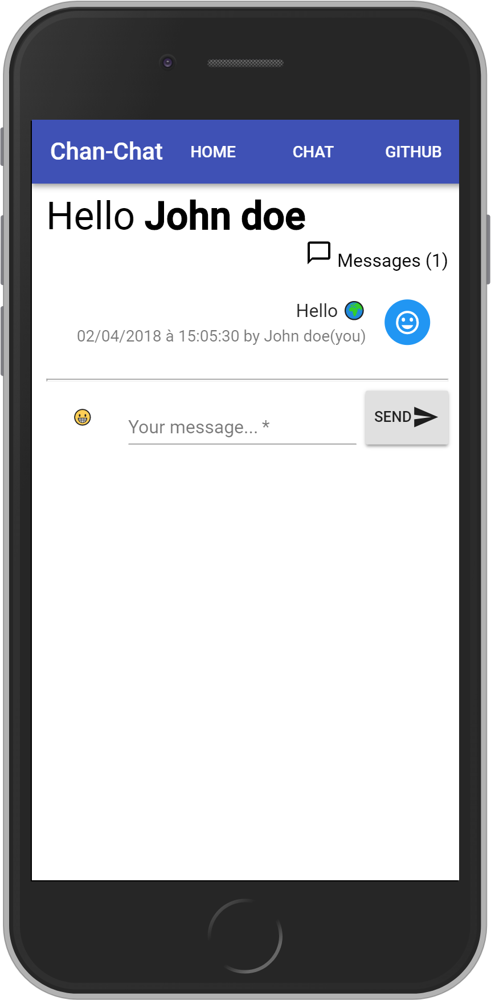

# Chat-react

<a href="http://demo.bilelz.fr/chat-react">
 
http://demo.bilelz.fr/chat-react</a>

Web app powered by 
* [React](https://reactjs.org)
* UI : [Material ui](http://www.material-ui.com)
* Icons : [Material.io](https://material.io/icons/)
* [Emoji Picker 🏬](https://missive.github.io/emoji-mart/)
* [Websocket (native)](https://github.com/bilelz/chan-react-websocket/blob/master/app.js)

